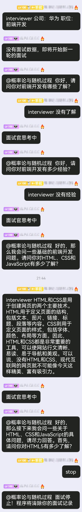

<div align="center">
  <a href="https://v2.nonebot.dev/store"></a>
  <br>
  <p></p>
</div>

<div align="center">

# nonebot-plugin-ai-interviewer
</div>

## 介绍
- 本插件基于OpenAI的API开发，在nonebot框架下实现一个聊天式的可自定义面试职位的AI辅助面试官。
- 本插件具有用户识别功能


## 安装

* 手动安装
  ```
  git clone https://github.com/Alpaca4610/nonebot-plugin-ai-interviewer.git
  ```

  下载完成后在bot项目的pyproject.toml文件手动添加插件：

  ```
  plugin_dirs = ["xxxxxx","xxxxxx",......,"下载完成的插件路径/nonebot-plugin-ai-interviewer"]
  ```
* 使用 pip
  ```
  pip install nonebot-plugin-ai-interviewer
  ```

## 配置文件

在Bot根目录下的.env文件中追加如下内容：

```
OPENAI_API_KEY = key
```

可选内容：
```
OPENAI_HTTP_PROXY = "http://127.0.0.1:8001"    # 中国大陆/香港IP调用API请使用代理访问api,否则有几率会被封禁
OPENAI_MODEL_NAME = "xxxxx"   # AI面试官使用的模型名称
```


## 使用方法

- 初始化AI面试官：（注意，命令中的逗号为中文逗号）
```
interviewer 公司：XXXX 职位：XXXXX
```
- 回答面试官问题
```
interviewer 你的回答
```
- 停止面试，开始下一轮面试需要重新初始化
```
stop
```
